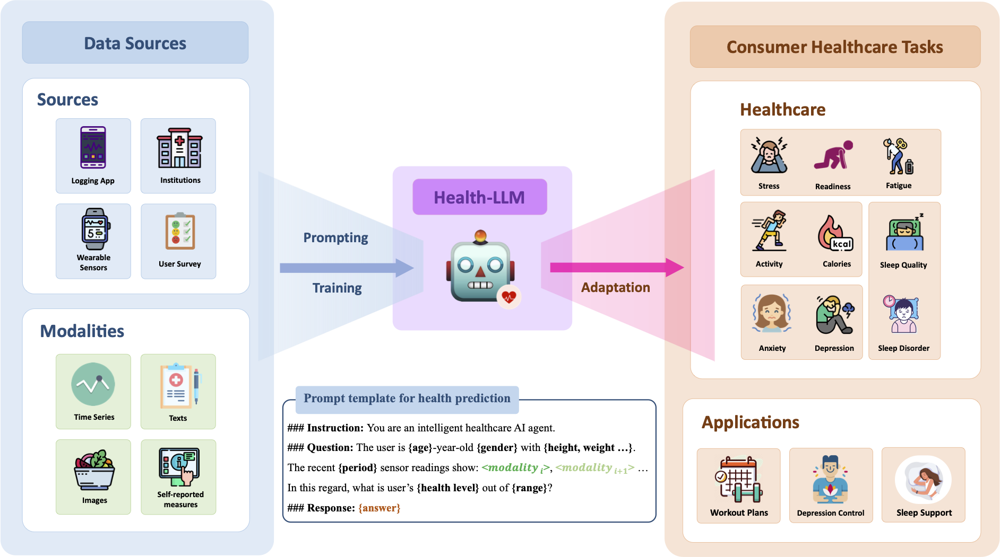

## Introspect-LLM: State-of-the-art LLM for Health Prediction

Introspect-LLM is a specialized, fine-tuned LLaMA 3.3 7B Instruct model designed for health prediction from wearable sensor data. Building on the medalpaca recipe and Health-LLM insights, it integrates user demographics, clinical knowledge, and temporal context to predict mental health, activity, metabolic, and sleep outcomes. We evaluate on four public datasets (PMData, LifeSnaps, GLOBEM, AW_FB) across ten tasks and demonstrate state-of-the-art performance on 7/10 tasks, outperforming larger commercial models. Our context-enhancement strategies yield up to 23.8% improvement over baseline prompting.

<p align="center">
  
</p>

<br>

## Quick Start

Create a new virtual environment, e.g. with conda

```bash
~$ conda create -n introspect-llm python>=3.9
```


Install the required packages:
```bash
~$ pip install -r requirements.txt
```

Activate the environment:
```bash
~$ conda activate introspect-llm
```

<br>

**Datasets**

1) PMData: [https://datasets.simula.no/pmdata/](https://datasets.simula.no/pmdata/)
2) LifeSnaps: [https://github.com/Datalab-AUTH/LifeSnaps-EDA](https://github.com/Datalab-AUTH/LifeSnaps-EDA)
3) GLOBEM: [https://physionet.org/content/globem/1.1/](https://physionet.org/content/globem/1.1/)
4) AW_FB: [https://dataverse.harvard.edu/dataset.xhtml?persistentId=doi:10.7910/DVN/ZS2Z2J](https://dataverse.harvard.edu/dataset.xhtml?persistentId=doi:10.7910/DVN/ZS2Z2J)

<br>

## Fine-tune

```bash
~$ bash finetune.sh
```

> [!TIP]
> Feel free to change the base model (--model) to `introspect-medalpaca/llama-3.3-7b-instruct` or `introspect-medalpaca/llama-3.3-13b-instruct`.
> If you need to change the training details, please refer to `./introspect-medalpaca/train.py`

<br>

## Inference

```bash
~$ python3 inference.py --model introspect-llm/llama-3.3-7b-instruct
```

<br>

If our work is helpful to you, please kindly cite our paper as:

```
@misc{kim2024healthllm,
      title={Health-LLM: Large Language Models for Health Prediction via Wearable Sensor Data}, 
      author={Yubin Kim and Xuhai Xu and Daniel McDuff and Cynthia Breazeal and Hae Won Park},
      year={2024},
      eprint={2401.06866},
      archivePrefix={arXiv},
      primaryClass={cs.CL}
}
```
