# Health Data Analysis and Visualization

This project provides comprehensive health data analysis and visualization tools for processing and analyzing personal health metrics. It handles various health data types including sleep patterns, physical activity, nutrition, body composition, and cardiovascular health.

## 🎯 Project Overview

This tool suite helps you:

- Track and visualize your health progress over time
- Identify patterns in your health behaviors
- Understand relationships between different health metrics
- Make data-driven decisions about your health

## 📊 Visualization Gallery

### Sleep Analysis (`sleep_analysis.png`)

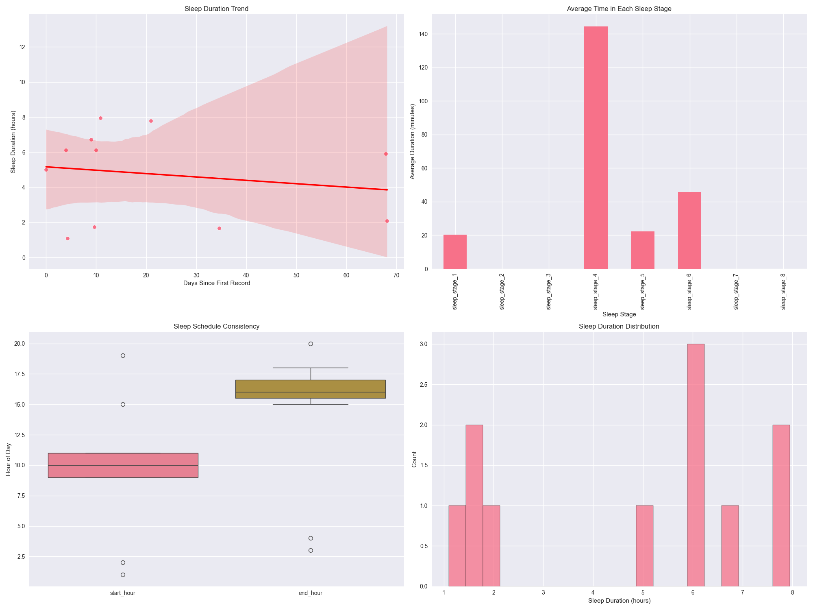

This visualization provides four key insights about your sleep:

1. **Sleep Duration Trend**

   - Tracks how your sleep duration changes over time
   - Blue dots show individual nights
   - Red line shows the overall trend
   - Helps identify if you're getting more or less sleep over time
2. **Sleep Stage Distribution**

   - Shows average time spent in each sleep stage (1-8)
   - Higher numbers generally indicate deeper sleep
   - Helps assess sleep quality
   - Important for understanding sleep architecture
3. **Sleep Schedule Consistency**

   - Box plots showing when you typically go to bed and wake up
   - Wider boxes indicate more variable schedules
   - Helps identify irregular sleep patterns
   - Useful for improving sleep hygiene
4. **Sleep Duration Distribution**

   - Shows how often you get different amounts of sleep
   - Helps identify your typical sleep duration
   - Useful for setting realistic sleep goals

### Activity Analysis (`activity_analysis.png` & `activity_insights.png`)

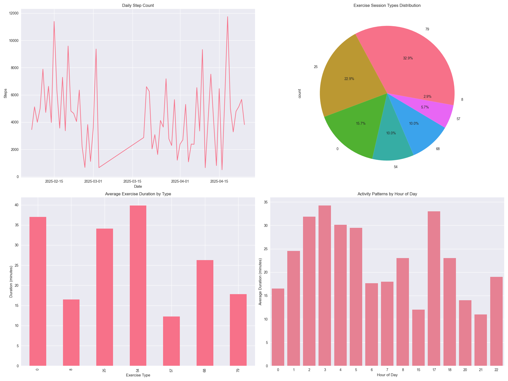
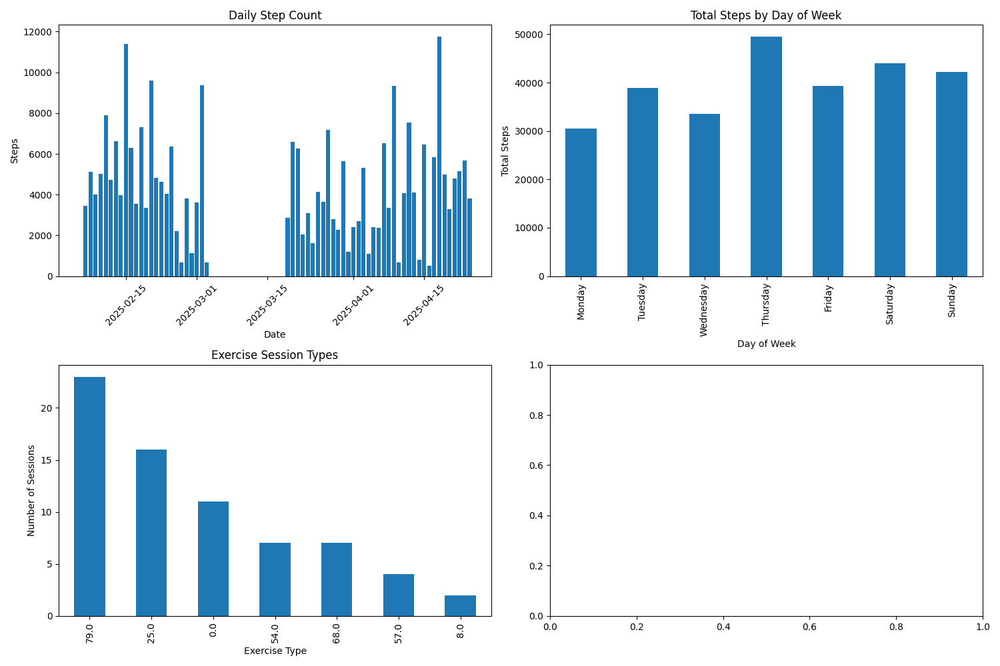

Comprehensive activity tracking through multiple views:

1. **Daily Step Count**

   - Bar chart showing steps per day
   - Helps track progress toward step goals
   - Identifies active and sedentary days
2. **Exercise Type Distribution**

   - Shows what types of exercises you prefer
   - Helps ensure workout variety
   - Useful for planning balanced exercise routines
3. **Duration Analysis**

   - Average time spent on each exercise type
   - Helps optimize workout planning
   - Tracks exercise commitment
4. **Activity Patterns**

   - When you're most active during the day
   - Helps optimize workout timing
   - Useful for establishing routines

### Body Composition (`body_composition_analysis.png` & `weight_and_body_composition_insights.png`)

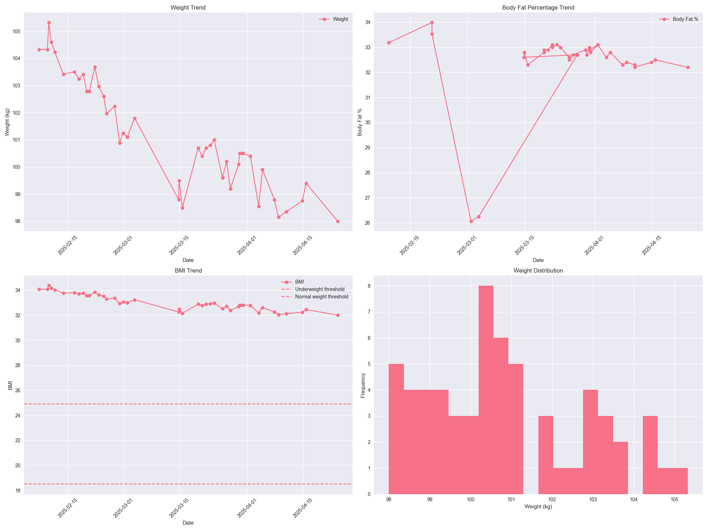
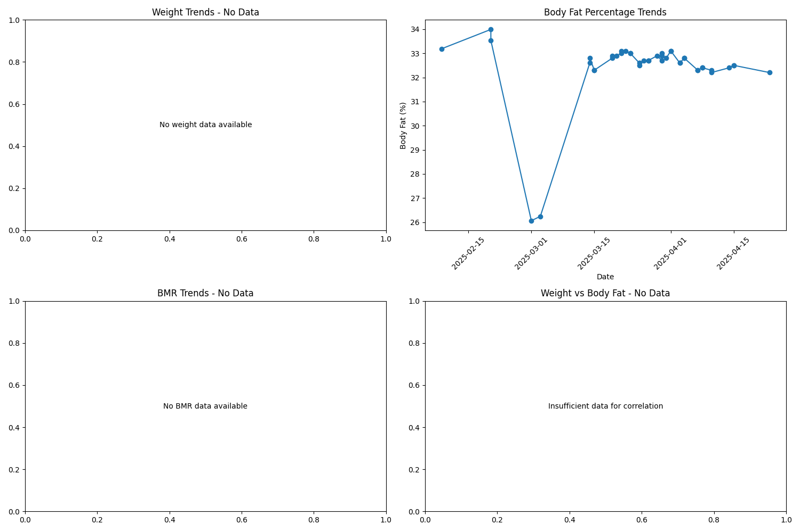

Detailed body composition tracking:

1. **Weight Trends**

   - Daily weight measurements
   - Trend line shows overall direction
   - Helps track progress toward weight goals
2. **Body Fat Analysis**

   - Body fat percentage over time
   - Helps track body composition changes
   - More meaningful than weight alone
3. **BMI Monitoring**

   - BMI calculations over time
   - Reference lines for health categories
   - Context for healthy weight ranges
4. **Weight Distribution**

   - Statistical view of weight measurements
   - Shows weight stability
   - Identifies unusual measurements

### Nutrition Analysis (`nutrition_analysis.png` & `nutrition_insights.png`)

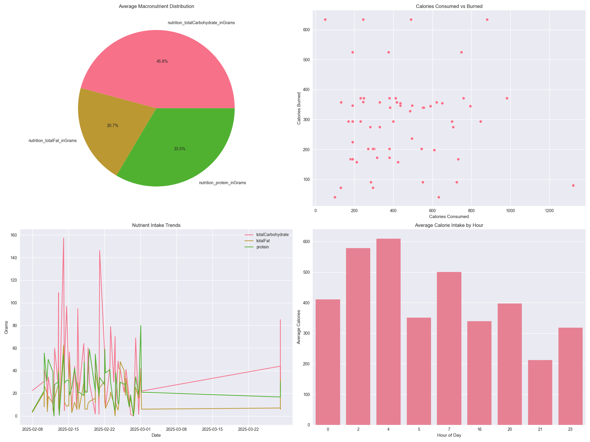
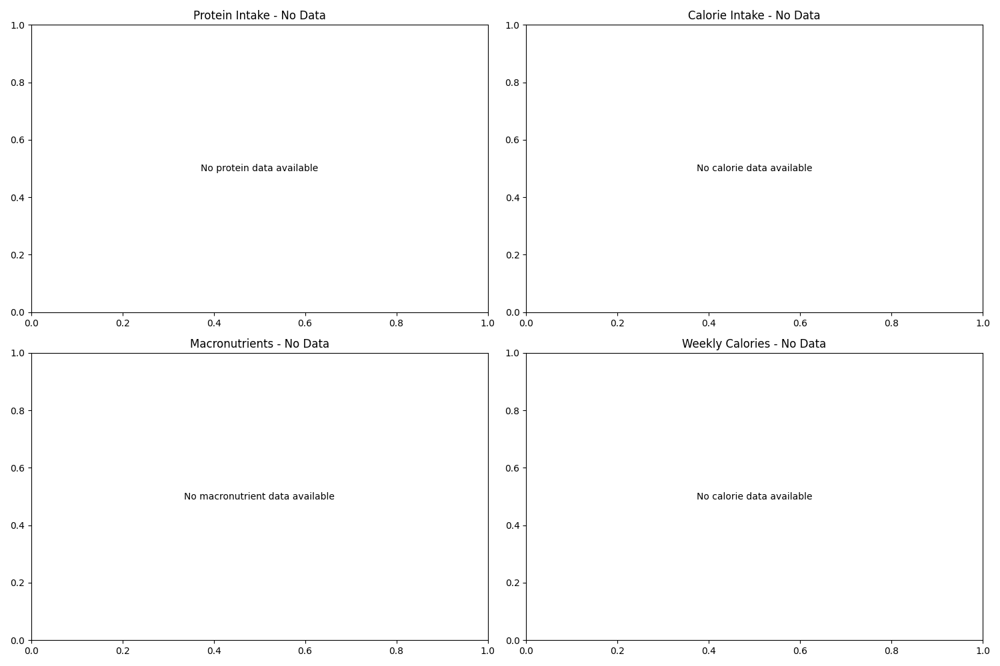

Detailed nutrition tracking:

1. **Macronutrient Balance**

   - Pie chart of carbs, fats, and proteins
   - Shows diet composition
   - Helps balance nutrition
2. **Caloric Balance**

   - Calories consumed vs. burned
   - Important for weight management
   - Helps understand energy balance
3. **Nutrient Tracking**

   - Changes in nutrient intake over time
   - Helps maintain consistent nutrition
   - Identifies dietary patterns
4. **Meal Timing**

   - When you typically eat
   - Helps optimize meal scheduling
   - Useful for intermittent fasting

### Cardiovascular Health (`cardiovascular_analysis.png` & `heart_rate_insights.png`)

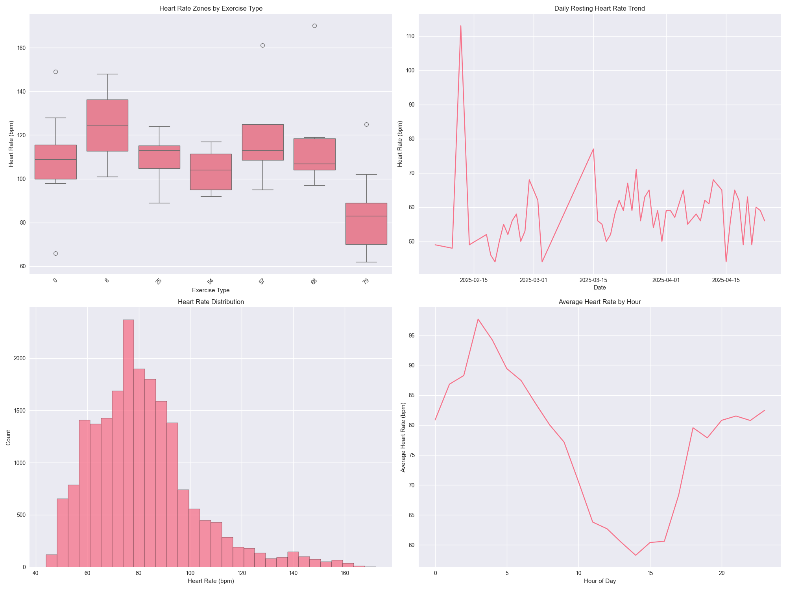
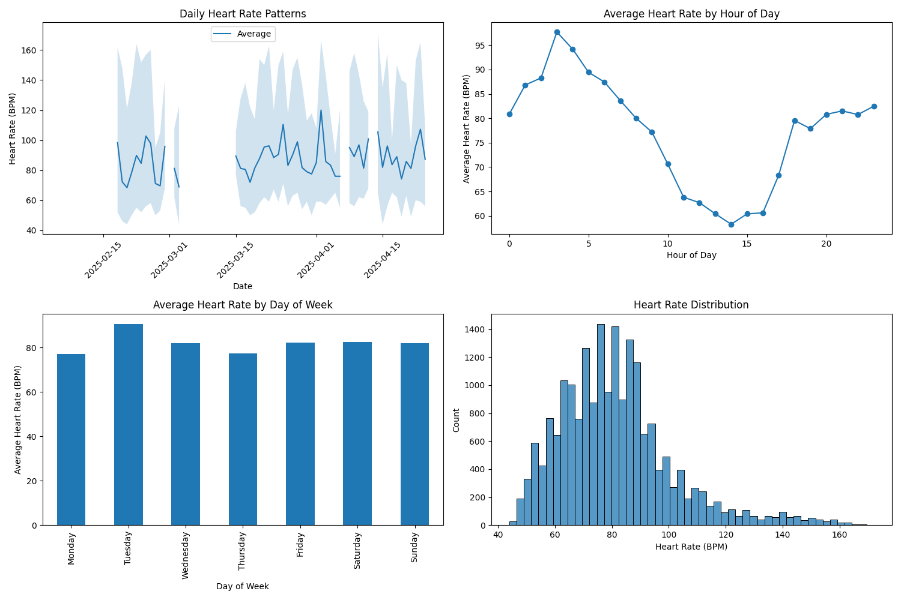

Comprehensive heart health monitoring:

1. **Exercise Heart Rate Zones**

   - Heart rate during different activities
   - Shows exercise intensity
   - Helps optimize workouts
2. **Resting Heart Rate**

   - Daily resting heart rate trend
   - Important health indicator
   - Shows cardiovascular fitness
3. **Heart Rate Distribution**

   - Overall heart rate patterns
   - Identifies unusual patterns
   - Shows heart rate variability
4. **Daily Patterns**

   - Hour-by-hour heart rate analysis
   - Shows daily cardiovascular patterns
   - Helps identify stress periods

### Fitness Progress (`fitness_progress.png`)

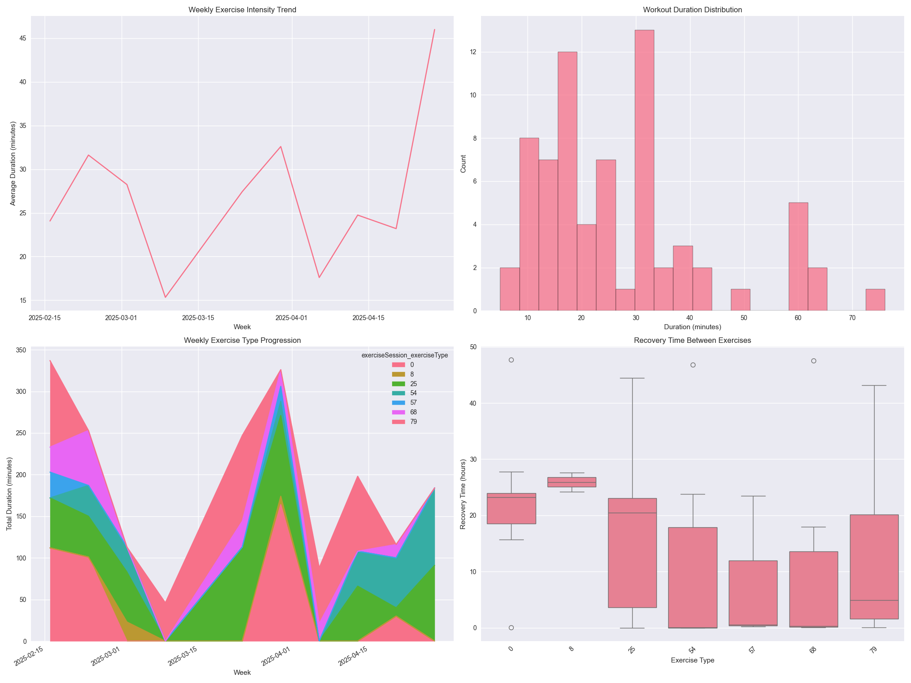

Long-term fitness tracking:

1. **Exercise Intensity**

   - Weekly intensity trends
   - Shows fitness progression
   - Helps prevent overtraining
2. **Workout Patterns**

   - Distribution of workout durations
   - Shows exercise consistency
   - Helps optimize training
3. **Exercise Evolution**

   - Changes in exercise preferences
   - Shows workout variety
   - Tracks fitness journey
4. **Recovery Analysis**

   - Rest periods between workouts
   - Helps prevent overtraining
   - Optimizes exercise scheduling

### Combined Dashboard (`combined_dashboard.png`)

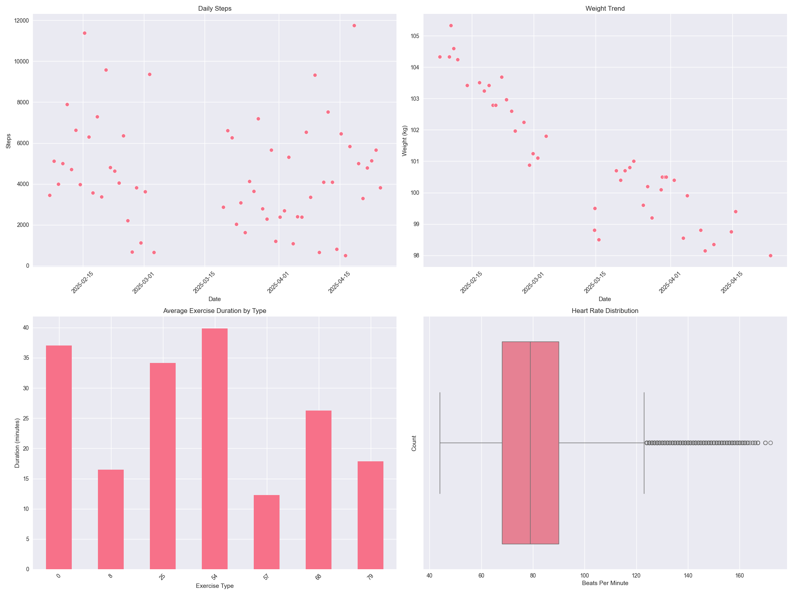

Single-view health overview:

- Daily activity levels
- Weight management
- Exercise patterns
- Heart rate metrics
- Perfect for quick health checks

### Correlation Analysis (`correlation_matrix.png`)

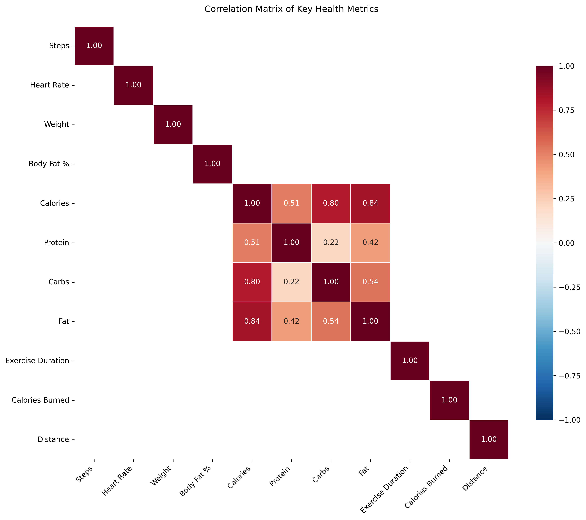

The correlation matrix provides insights into relationships between key health metrics:

1. **Understanding the Values**

   - Values range from -1 to +1
   - +1 indicates perfect positive correlation
   - -1 indicates perfect negative correlation
   - 0 indicates no linear correlation
2. **Key Relationships**

   - **Activity Correlations**

     - Steps vs Exercise Duration: Shows relationship between daily activity and workout time
     - Heart Rate vs Exercise: Indicates cardiovascular response to activity
   - **Body Composition**

     - Weight vs Body Fat %: Shows relationship between total mass and body composition
     - Calories vs Weight: Indicates impact of energy intake on body mass
   - **Nutrition Impact**

     - Macronutrient Relationships: Correlations between protein, carbs, and fat intake
     - Calories vs Exercise: Shows energy balance patterns
3. **Interpretation Guide**

   - **Strong Positive Correlation (0.7 to 1.0)**

     - As one metric increases, the other increases strongly
     - Example: Exercise Duration ↑ → Heart Rate ↑
   - **Moderate Positive Correlation (0.3 to 0.7)**

     - As one metric increases, the other tends to increase
     - Example: Steps ↑ → Calories Burned ↑
   - **Weak Positive Correlation (0 to 0.3)**

     - Slight tendency to increase together
     - Example: Sleep Duration ↑ → Recovery Rate ↑
   - **Negative Correlations**

     - Inverse relationships between metrics
     - Example: Body Fat % ↓ → Exercise Duration ↑
4. **Using This Information**

   - Identify which activities most impact your health goals
   - Understand relationships between diet and exercise
   - Optimize workout timing and nutrition
   - Track progress through related metrics
5. **Notable Patterns**

   - Sleep quality correlations with next-day activity
   - Nutrition timing impact on exercise performance
   - Recovery patterns related to exercise intensity
   - Daily rhythm effects on various metrics

### Advanced Insights (`advanced_insights.png`)

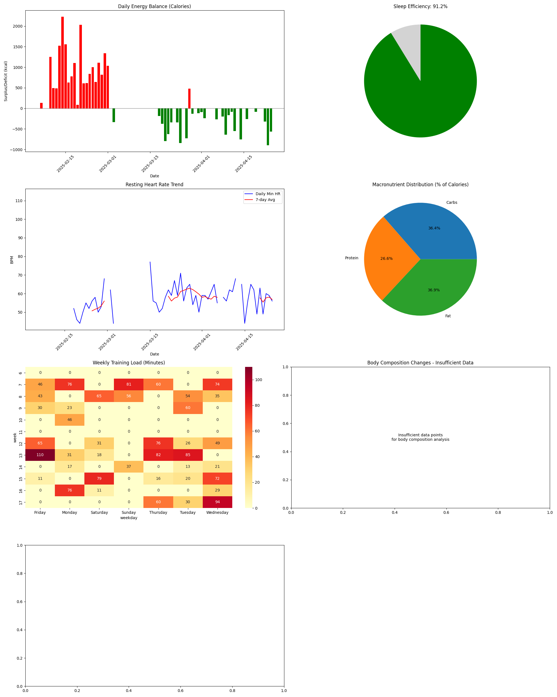

The advanced insights visualization provides seven specialized views of your health data:

1. **Daily Energy Balance**
   - Color-coded bars showing caloric surplus/deficit
   - Green bars indicate caloric deficit
   - Red bars indicate caloric surplus
   - Black line at zero for reference
   - Helps track weight management goals

2. **Sleep Efficiency Score**
   - Gauge showing percentage of quality sleep
   - Excludes light sleep (stage 1) from efficiency calculation
   - Green portion shows efficient sleep percentage
   - Useful for tracking sleep quality improvements

3. **Resting Heart Rate Tracker**
   - Daily minimum heart rate trend
   - 7-day moving average
   - Red alert markers for significant increases
   - Important cardiovascular health indicator
   - Early warning system for overtraining or illness

4. **Macro Breakdown**
   - Pie chart showing caloric distribution
   - Carbohydrates (4 kcal/g)
   - Protein (4 kcal/g)
   - Fat (9 kcal/g)
   - Helps balance nutritional intake

5. **Training Load Heatmap**
   - Weekly grid showing exercise minutes
   - Color intensity indicates workout duration
   - Helps identify training patterns
   - Useful for planning rest days
   - Prevents overtraining

6. **Body Fat vs Weight Scatter**
   - Relationship between weight and body fat
   - Trend line shows overall direction
   - Helps distinguish between:
     - Muscle gain vs fat gain
     - Fat loss vs muscle loss
   - Tracks body composition changes

7. **BMR vs Intake Dial**
   - Gauge showing caloric intake vs BMR
   - Green: Within healthy range (<110% BMR)
   - Yellow: Moderate surplus (110-120% BMR)
   - Red: High surplus (>120% BMR)
   - Helps maintain healthy energy balance

These advanced visualizations provide deeper insights into:
- Energy balance and weight management
- Sleep quality optimization
- Cardiovascular health monitoring
- Nutritional balance
- Training load management
- Body composition changes
- Metabolic health

## 🚀 Getting Started

### Prerequisites

- Python 3.x
- Required packages:
  ```bash
  pip install pandas matplotlib seaborn numpy pathlib
  ```

### Installation

1. Clone the repository:

   ```bash
   git clone https://github.com/yourusername/health-connect.git
   cd health-connect
   ```
2. Install dependencies:

   ```bash
   pip install -r requirements.txt
   ```

### Data Preparation

1. Place your health data in the `Data` directory
2. Ensure data files follow the required format:
   - CSV files with appropriate column names
   - Datetime columns named 'start' and 'end'
   - Numerical data in appropriate units

### Running the Analysis

1. Run the analysis scripts in sequence:
   ```bash
   python 3_analyze_health_data.py
   python 4_visualize_health_insights.py
   ```
2. View generated visualizations in `analysis_output/`

## 📁 Project Structure

```
health-connect/
├── Data/                           # Health data directory
│   ├── someshbgd3/                # User-specific data
│   │   ├── Cleaned/               # Processed data
│   │   └── Uncleaned/            # Raw data
├── analysis_output/               # Generated visualizations
├── 3_analyze_health_data.py       # Analysis script
├── 4_visualize_health_insights.py # Visualization script
├── requirements.txt               # Package dependencies
└── README.md                      # Documentation
```

## 🔍 Analysis Features

### Temporal Analysis

- **Trend Identification**
  - Long-term progress tracking
  - Seasonal variation analysis
  - Weekly and monthly patterns
  - Progress tracking
  - Pattern recognition

### Statistical Analysis

- **Distribution Analysis**

  - Normal ranges for each metric
  - Outlier identification
  - Variance analysis
  - Trend significance testing
- **Correlation Studies**

  - Inter-metric relationships
  - Time-based correlations
  - Activity-recovery patterns
  - Nutrition-performance links

### Health Metrics

- Sleep quality
- Physical activity
- Nutrition
- Cardiovascular health
- Body composition

## 📊 Advanced Insights

### Sleep-Activity Relationships

1. **Exercise Impact on Sleep**

   - Optimal workout times for better sleep
   - Recovery patterns after intense workouts
   - Sleep quality vs exercise intensity
2. **Sleep Quality Effects**

   - Next-day performance impact
   - Recovery quality assessment
   - Sleep debt analysis

### Nutrition-Performance Connections

1. **Meal Timing Analysis**

   - Pre-workout nutrition impact
   - Post-workout recovery nutrition
   - Energy levels throughout the day
2. **Macronutrient Effects**

   - Performance correlation with diet composition
   - Recovery rate vs nutrition balance
   - Energy availability patterns

### Long-term Health Patterns

1. **Seasonal Variations**

   - Activity level changes across seasons
   - Sleep pattern adjustments
   - Nutritional adaptations
2. **Progress Indicators**

   - Fitness level progression
   - Body composition changes
   - Cardiovascular health improvements

## 🔬 Data Quality Management

### Data Preprocessing

1. **Cleaning Procedures**

   - Missing data handling
   - Outlier detection and treatment
   - Time series alignment
   - Data normalization
2. **Quality Assurance**

   - Data validation checks
   - Consistency verification
   - Cross-metric validation
   - Temporal consistency

### Advanced Analytics Potential

1. **Machine Learning Applications**

   - Sleep quality prediction
   - Activity recommendation engine
   - Nutrition optimization
   - Recovery time forecasting
2. **Custom Health Metrics**

   - Overall fitness score
   - Recovery readiness index
   - Health balance indicator
   - Progress tracking score

### Data Integration

1. **Cross-metric Analysis**

   - Sleep-activity relationships
   - Nutrition-performance correlations
   - Recovery-intensity patterns
   - Long-term trend analysis
2. **External Factors**

   - Weather impact on activity
   - Seasonal pattern adjustment
   - Life event correlations
   - Environmental influences
